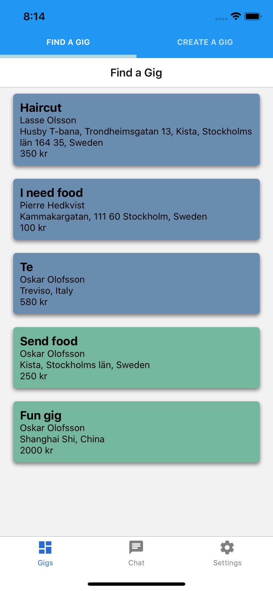
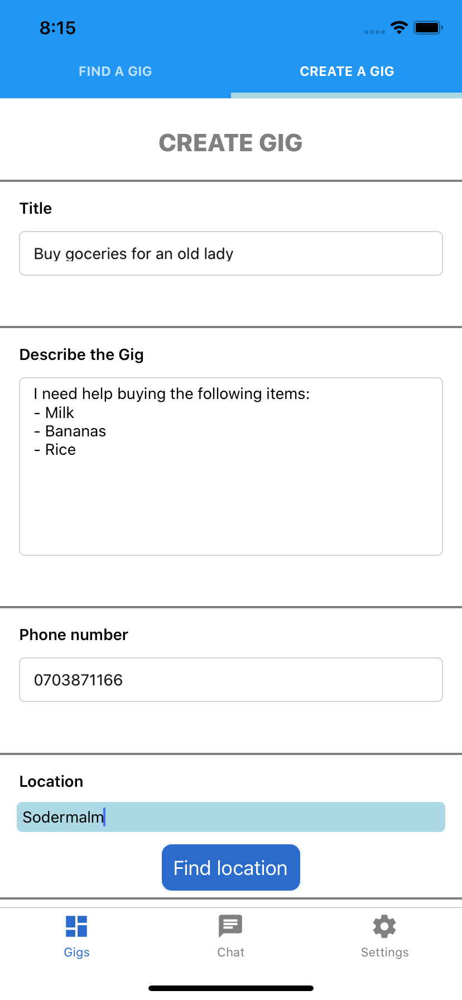
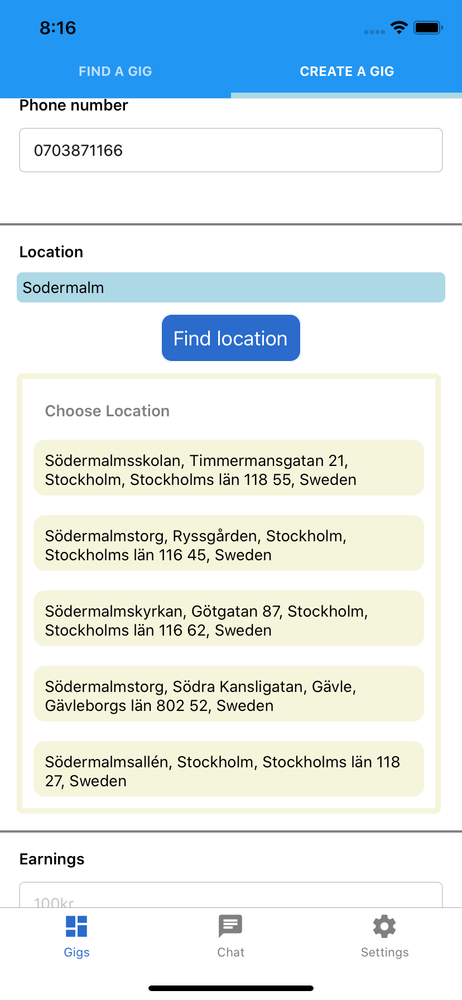
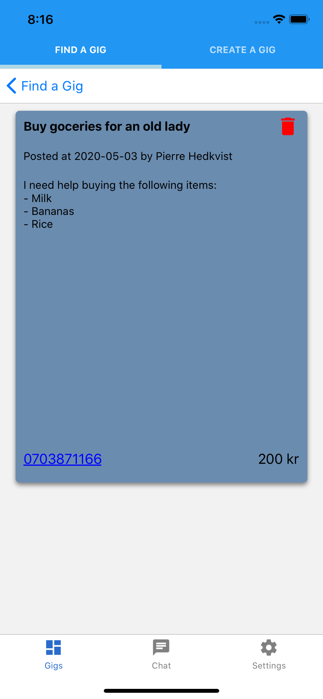

# Pandegig
#### A React Native app built during Hackthecrisis.se and EUvsVirus.org hackathons

## Problem
Many people have lost their source of income during the Covid-19 pandemic. And some people and companies are in need of help during this difficult time.

## Solution
This app brings people and businesses together. Pandemic meets the gig-economy, Pandegig. A platform where people and business can post gigs that other people can get paid for.

## Screenshots

## Features
 - Users can post gigs, ie a description of what the task is, where it is located, how much earnings the worker gets.
 - List of gigs based on your current location, were new gigs are favored above old ones.
 - Chat with the person who posted the gig. Once the gig is accepted you will start chatting with the poster and figure out how and when you will help the person.
## Technical Solution
- React Native
  - React Navigation
  - Custom made state management using React Navigation
  - AWS Amplify, a JS library for handling authentication on the frontend, which connects to AWS Cognito in the backend.
- Mapbox. 
  - Finding actual street adresses and their latitude and longitude coordinates when writing the address of the gig when creating one.

- AWS
  - Cognito for authentication
  - Lambda functions for creating, deleting, getting the gigs and chat.
  - DynamoDB for saving the gigs.
